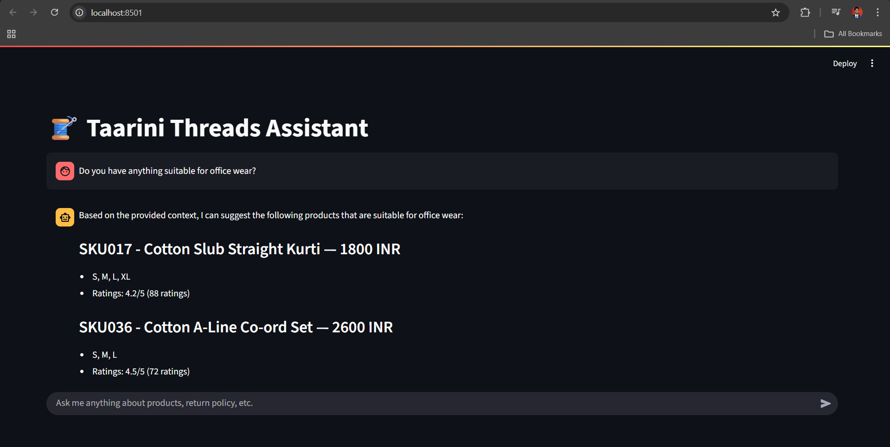

# RAG_FASHION_CHATBOT
# 🧵 Taarini Threads Assistant

A fashion-focused AI assistant for answering queries about products, policies, and collections using **Retrieval-Augmented Generation (RAG)**. Built using **LangChain**, **FAISS**, **Hugging Face Embeddings**, and **Streamlit**, and powered by **Groq's LLaMA 3** models.

---

## ✨ Features

- 💬 Natural language chat with product catalog and brand policies
- 🔍 Search products using semantic similarity with FAISS
- 🎯 Filter products by price (e.g., "under Rs 3000")
- ⭐ Sort products by customer ratings
- 📑 Answer brand-specific questions using policy documents
- ✅ RAG-based architecture using LLM and vector DB
- ⚡ Fast inference using Groq API

---

## 🚀 Demo

 <!-- optional: replace or remove if not available -->

---

## 📁 Folder Structure
taarini-assistant/
│
├── app.py # Streamlit frontend + LLM interaction
├── rag_fashion_chatbot.py # RAG pipeline and vector DB creation
├── requirements.txt # Python dependencies
├── .env.example # Template for environment variables
├── README.md # You're here!
│
├── Knowledgebase/
│ ├── Product_metadata.json # Product catalog (JSON format)
│ └── policies/ # Brand policies (e.g., shipping, return)
│ ├── shipping.txt
│ └── return.txt
│
├── faiss_index/ # Vector DB index created by FAISS
├── assets/
│ └── screenshot.png # Optional: UI image for demo


---

## 🛠️ Tech Stack

| Component        | Tool/Library                          |
|------------------|----------------------------------------|
| Vector DB        | FAISS                                 |
| Embeddings       | HuggingFace (MiniLM)                  |
| LLM              | Groq (LLaMA 3 via `langchain_groq`)   |
| Frontend         | Streamlit                             |
| Prompting        | LangChain `PromptTemplate`            |
| Text Splitting   | LangChain's `RecursiveCharacterTextSplitter` |
| RAG Pipeline     | Custom with context injection         |

---

## ⚙️ Installation

```bash
# Clone the repo
git clone https://github.com/your-username/taarini-assistant.git
cd taarini-assistant

# Create virtual environment
python -m venv .venv
source .venv/bin/activate  # or .venv\Scripts\activate on Windows

# Install dependencies
pip install -r requirements.txt
```

##🧠 Building the Vector DB
Before running the assistant, build the FAISS vector store:

bash
```
python rag_fashion_chatbot.py
```
##💻 Run the Assistant
bash
```
streamlit run app.py
```
Then open http://localhost:8501 in your browser.

